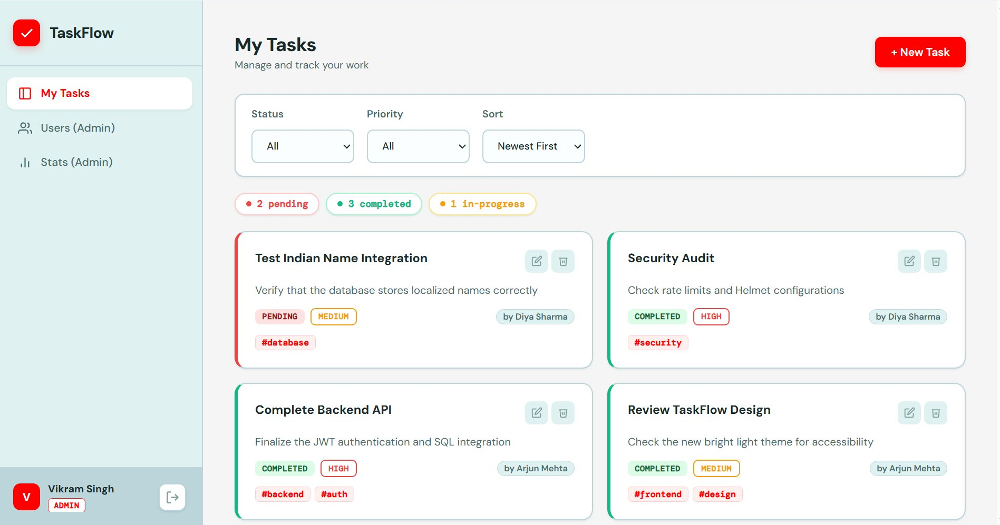
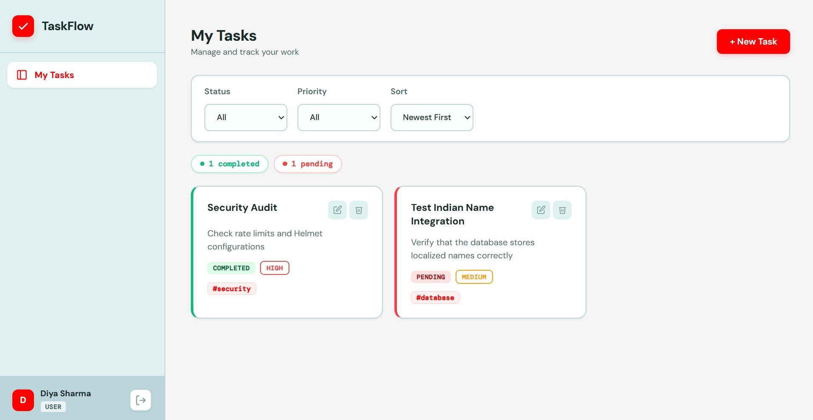
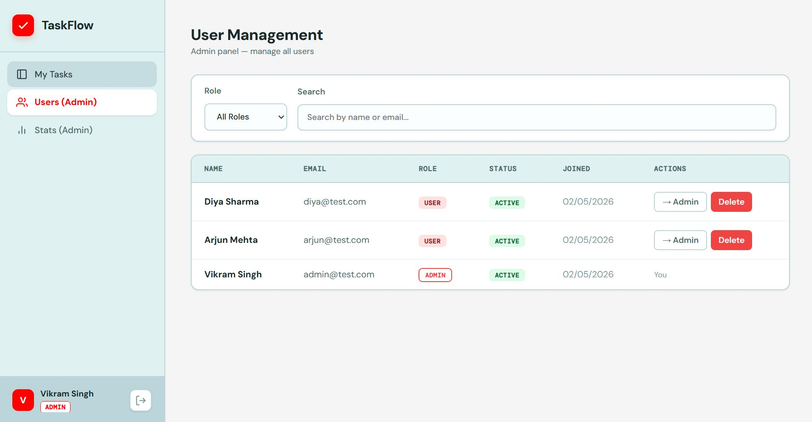
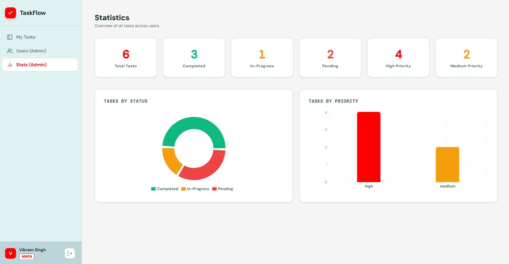

<div align="center">


#  TaskFlow

**A full-stack task management app with JWT authentication and role-based access control.**

Built with Node.js + Express on the backend and React + Vite on the frontend.

</div>

---

## Screenshots

| Admin Dashboard | User Dashboard |
|---|---|
|  |  |

| User Management | Statistics |
|---|---|
|  |  |

---

## Features

**Authentication & Security**
- JWT access tokens + refresh token rotation
- Bcrypt password hashing (salt rounds: 12)
- Helmet security headers
- Rate limiting on auth endpoints
- Input validation via `express-validator`
- XSS sanitization

**Role-Based Access Control**
- `user` — can create, view, edit and delete their own tasks only
- `admin` — full access to all tasks, all users and statistics dashboard

**Task Management**
- Create tasks with title, description, status, priority, due date and tags
- Filter by status (`pending`, `in-progress`, `completed`) and priority (`low`, `medium`, `high`)
- Sort by newest, oldest, or due date
- Paginated task list

**Admin Panel**
- View and search all registered users
- Promote/demote user roles
- Delete user accounts
- Visual stats with pie chart (status breakdown) and bar chart (priority breakdown)

**Frontend**
- Built with React + Vite
- Protected routes (auth-gated, role-gated)
- Token refresh handled silently in the background
- Toast notifications for all actions
- Fully responsive

---

## 🛠 Tech Stack

| Layer | Technology |
|---|---|
| Runtime | Node.js |
| Framework | Express.js |
| Database | SQLite + Sequelize ORM |
| Auth | JWT (Access + Refresh Tokens) |
| Validation | express-validator |
| Security | Helmet, CORS, express-rate-limit, xss-clean |
| Frontend | React 18 + Vite |
| Charts | Recharts |
| HTTP | Fetch API with auto token refresh |

> **Why Node.js over Python?**  
> Node.js was chosen for its non-blocking I/O model, making it better suited for a task management API that handles many concurrent requests. The Express ecosystem also has mature, battle-tested packages for JWT, validation and security that integrate cleanly. The codebase follows MVC architecture with a clean separation of routes, controllers, models, validators and middleware — the same patterns used in production Node.js services.

---

## Quick Start

### Prerequisites
- Node.js 18+
- npm

### 1. Clone & Install

```bash
git clone https://github.com/nekorei05/taskflow.git
cd taskflow

# Install backend dependencies
cd backend && npm install

# Install frontend dependencies
cd ../frontend && npm install
```

### 2. Configure Environment

```bash
# In /backend, create a .env file
cp .env.example .env
```

```env
PORT=5002
NODE_ENV=development
JWT_SECRET=your_secret_key_here
JWT_EXPIRES_IN=15m
JWT_REFRESH_SECRET=your_refresh_secret_here
JWT_REFRESH_EXPIRES_IN=7d
```

### 3. Seed the Database

This creates the SQLite database and populates test accounts:

```bash
cd backend
node src/utils/seed.js
```

**Test Accounts:**

| Email | Password | Role |
|---|---|---|
| admin@test.com | Admin123 | Admin |
| arjun@test.com | Arjun123 | User |
| diya@test.com | Diya123 | User |

### 4. Run the App

```bash
# Terminal 1 — Backend
cd backend && npm run dev

# Terminal 2 — Frontend (http://localhost:5173)
cd frontend && npm run dev
```

---

## API Reference

Base URL: `http://localhost:5002/api/v1`

All protected routes require: `Authorization: Bearer <access_token>`

### Auth

| Method | Endpoint | Auth | Description |
|---|---|---|---|
| POST | `/auth/register` | ❌ | Register new user |
| POST | `/auth/login` | ❌ | Login, returns tokens |
| POST | `/auth/refresh` | ❌ | Refresh access token |
| POST | `/auth/logout` | ✅ | Invalidate refresh token |
| GET | `/auth/me` | ✅ | Get current user profile |

### Tasks

| Method | Endpoint | Auth | Role | Description |
|---|---|---|---|---|
| GET | `/tasks` | ✅ | Any | List tasks (users see own; admins see all) |
| POST | `/tasks` | ✅ | Any | Create a task |
| GET | `/tasks/:id` | ✅ | Any | Get task by ID |
| PATCH | `/tasks/:id` | ✅ | Owner / Admin | Update task |
| DELETE | `/tasks/:id` | ✅ | Owner / Admin | Delete task |
| GET | `/tasks/stats` | ✅ | Admin | Aggregated statistics |

**Query parameters for `GET /tasks`:** `status`, `priority`, `sort`, `page`, `limit`

### Users (Admin Only)

| Method | Endpoint | Auth | Role | Description |
|---|---|---|---|---|
| GET | `/users` | ✅ | Admin | List all users |
| GET | `/users/:id` | ✅ | Admin | Get user by ID |
| PATCH | `/users/:id` | ✅ | Admin | Update role / status |
| DELETE | `/users/:id` | ✅ | Admin | Delete user |

### Sample Request

```bash
# Login
curl -X POST http://localhost:5002/api/v1/auth/login \
  -H "Content-Type: application/json" \
  -d '{"email":"admin@test.com","password":"Admin123"}'

# Create a task
curl -X POST http://localhost:5002/api/v1/tasks \
  -H "Authorization: Bearer <token>" \
  -H "Content-Type: application/json" \
  -d '{"title":"Fix login bug","priority":"high","status":"in-progress"}'
```

---

## Testing with Postman

A full Postman collection is included:

1. Open Postman
2. Click **Import**
3. Select `docs/TaskFlow.postman_collection.json`
4. Use the Login request first — the collection auto-saves the token as an environment variable

---

## Scalability

This project is architected to scale. Key decisions made for production-readiness:

**Database** — SQLite works for development and low-traffic deployments. The Sequelize ORM abstracts the database layer, so migrating to PostgreSQL or MySQL requires only a config change and dialect swap — no rewrite needed.

**Caching** — Auth token validation currently hits the database on every request. Adding Redis as a token cache would eliminate this overhead entirely, reducing latency under high load.

**Infrastructure** — The backend is stateless (no session state stored in memory), which means it can be horizontally scaled behind a load balancer (NGINX or an AWS ALB) without sticky sessions. Containerizing with Docker and orchestrating with Kubernetes would enable auto-scaling based on traffic.

**API Versioning** — All routes are prefixed with `/api/v1/`. Introducing breaking changes can be done by adding a `/v2/` route set without touching existing clients.

**Separation of Concerns** — The codebase follows strict MVC. Controllers handle HTTP, models handle data, middleware handles cross-cutting concerns. This makes it straightforward to extract services (e.g., a standalone notification service) without touching the core request cycle.

---

## Security Practices

- Passwords hashed with bcrypt (12 salt rounds)
- JWT access tokens expire in 15 minutes; refresh tokens rotated on each use
- Helmet sets secure HTTP headers (CSP, HSTS, X-Frame-Options)
- Rate limiting on `/auth/*` endpoints prevents brute force
- `xss-clean` strips script tags from all input
- RBAC enforced at the middleware level — not in controllers

---

