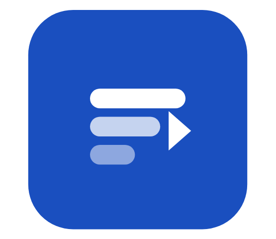
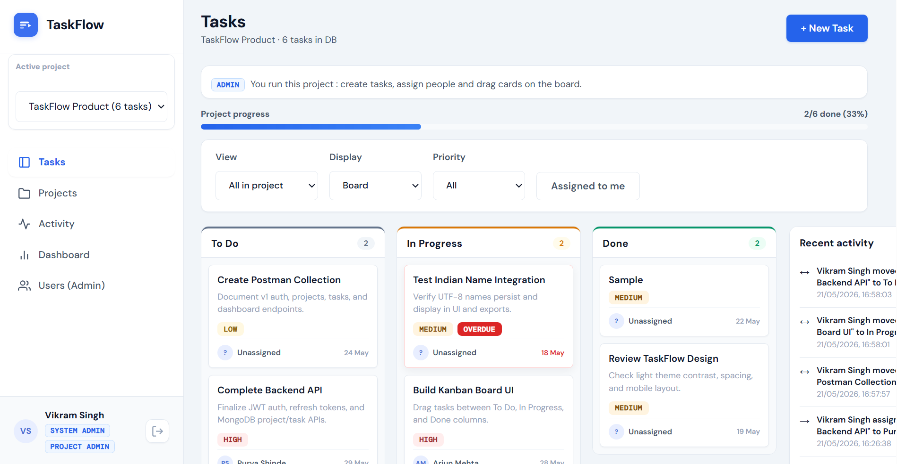

<div align="center">

# TaskFlow 
<h1 align="center">
  
  TaskFlow
</h1>


### Collaborative Team Task Management

Manage projects, assign tasks, track workflows, and collaborate through a modern Kanban-based productivity platform inspired by Trello and Asana.

<br/>

[Live Application](https://taskflow-frontend-rosy-seven.vercel.app) • [Demo Video](https://drive.google.com/file/d/1Xchih9mLz8Bw-9qVWasO8EUTZkAjaDPI/view?usp=sharing)

</div>

---

# Application Preview

<br/>

<p align="center">
  
</p>

---

<div align="center">

### Workflow management made intuitive

TaskFlow focuses on collaborative workflows, project-scoped role management, Kanban productivity, dashboard analytics and workflow-focused UX designed to simulate real-world team collaboration systems.

</div>

---

# What is TaskFlow?

TaskFlow is a full-stack collaborative task management platform built as a real-world internship assessment project using the MERN stack.

The goal of the project was not just to implement CRUD functionality, but to simulate a modern workflow environment similar to tools like Trello, Jira and Asana.

The application focuses on:

* collaborative project management
* Kanban-based workflows
* role-based permissions
* dashboard analytics
* workflow-focused UX
* secure backend architecture

---

# Demo Credentials

| Role   | Email                                   | Password |
| ------ | --------------------------------------- | -------- |
| Admin  | [admin@test.com](mailto:admin@test.com) | Admin123 |
| Member | [arjun@test.com](mailto:arjun@test.com) | Arjun123 |

---

# Covers Assignment Requirements

| Requirement                     | Status |
| ------------------------------- | ------ |
| JWT Authentication              | ✅      |
| Team Project Management         | ✅      |
| Task Assignment & CRUD          | ✅      |
| Dashboard Analytics             | ✅      |
| Role-Based Access Control       | ✅      |
| RESTful APIs                    | ✅      |
| Database Relationships          | ✅      |
| Deployment (Frontend + Backend) | ✅      |
| Environment Variables           | ✅      |
| Publicly Accessible App         | ✅      |

---

# Features

## Authentication & Security

* JWT access tokens + refresh token flow
* Password hashing using bcrypt
* Protected routes with middleware authorization
* Rate limiting & Helmet security headers
* Role-based access control (RBAC)

---

## Project Collaboration

* Create collaborative team projects
* Project-scoped Admin & Member roles
* Add or remove project members
* Manage team-based workflows
* Active project switching

---

## Task Management

* Create, assign, edit, and delete tasks
* Drag-and-drop Kanban workflow
* Status tracking:

  * To Do
  * In Progress
  * Done
* Priority levels:

  * Low
  * Medium
  * High
* Due dates with overdue highlighting
* Task filtering and sorting

---

## Dashboard & Analytics

* Project completion tracking
* Tasks by status analytics
* Tasks per assignee breakdown
* Overdue task monitoring
* Activity timeline feed

---

# Workflow-Focused UX

TaskFlow includes lightweight contextual guidance throughout the application to improve usability and reduce onboarding friction for different user roles.

Examples include:

* Member-specific permission guidance
* Project-scoped workflow instructions
* Role-aware task management hints
* Visual overdue highlighting
* Status-based workflow indicators

Small UX decisions like these were intentionally added to make the platform feel more intuitive and collaborative for first-time users.

Example:

> "Members can only update tasks assigned to them and track progress on the board."

This helps users immediately understand their permissions without needing separate documentation.

---

# Why TaskFlow?

Most student task manager projects stop at basic CRUD operations.

TaskFlow was designed to simulate a more realistic collaborative workflow system with:

* project-scoped RBAC
* workflow analytics
* Kanban interaction
* activity tracking
* responsive SaaS-style UI
* secure authentication
* scalable REST API architecture

The focus was not only backend functionality, but also creating a platform that feels practical and intuitive for team collaboration.

---
# Tech Stack

| Frontend              | Backend            | Deployment    |
| --------------------- | ------------------ | ------------- |
| React.js              | Node.js            | Vercel        |
| Vite                  | Express.js         | Render        |
| React Router          | MongoDB            | MongoDB Atlas |
| Recharts              | Mongoose           |               |
| CSS Custom Properties | JWT Authentication |               |
|                       | bcrypt             |               |
|                       | express-rate-limit |               |

---

# Key Engineering Decisions

* MongoDB was chosen for flexible project/task relationship modeling and easier deployment for collaborative workflows.
* JWT access + refresh token flow was implemented for secure authentication handling.
* Project-scoped RBAC is enforced server-side to ensure users only access authorized resources.
* The frontend uses protected layouts and route-based navigation for a cleaner SaaS-style workflow.
* Kanban workflows and activity tracking were prioritized to better simulate real-world collaboration tools.

---

# Role-Based Access

| Action                   | Admin | Member |
| ------------------------ | ----- | ------ |
| Create project           | ✅     | ❌      |
| Add / remove members     | ✅     | ❌      |
| Create & assign tasks    | ✅     | ❌      |
| Update assigned tasks    | ✅     | ✅      |
| View Kanban board        | ✅     | ✅      |
| View dashboard analytics | ✅     | ✅      |

---

# API Reference

## Authentication

```http
POST   /api/v1/auth/register
POST   /api/v1/auth/login
POST   /api/v1/auth/refresh
```

## Projects

```http
GET    /api/v1/projects
POST   /api/v1/projects
GET    /api/v1/projects/:id
PATCH  /api/v1/projects/:id
POST   /api/v1/projects/:id/members
DELETE /api/v1/projects/:id/members/:userId
```

## Tasks

```http
GET    /api/v1/tasks
POST   /api/v1/tasks
GET    /api/v1/tasks/:id
PATCH  /api/v1/tasks/:id
DELETE /api/v1/tasks/:id
```

---

# Local Setup

## Prerequisites

* Node.js v18+
* MongoDB Atlas account (or local MongoDB)

---

## Clone Repository

```bash
git clone https://github.com/nekorei05/taskflow.git
cd taskflow
```

---

## Backend Setup

```bash
cd backend
npm install
```

Create `backend/.env`

```env
MONGODB_URI=your_mongodb_uri
JWT_SECRET=your_jwt_secret
JWT_REFRESH_SECRET=your_refresh_secret
CLIENT_URL=http://localhost:5173
PORT=5000
```

Run backend:

```bash
npm run dev
```

---

## Frontend Setup

```bash
cd frontend
npm install
```

Create `frontend/.env`

```env
VITE_API_URL=http://localhost:5000/api/v1
```

Run frontend:

```bash
npm run dev
```

Application runs at:

```bash
http://localhost:5173
```
---

# Future Improvements

* Real-time collaboration using WebSockets
* Notifications system
* Task comments & attachments
* Calendar integration
* Workspace-level permissions
* Dark mode support

